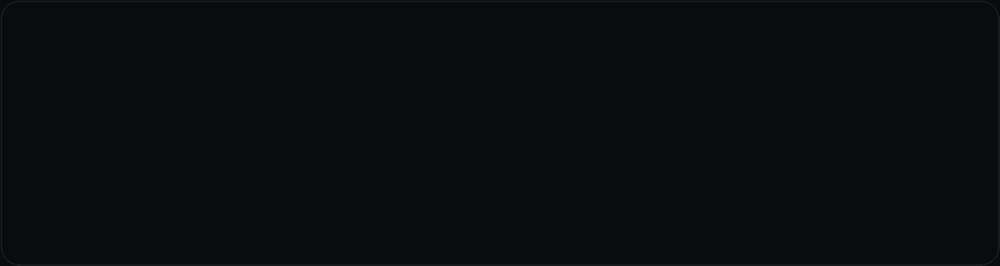

# Seungwan Jeong

  

<em>
I build systems that fail loudly, preserve evidence, and remain reproducible. 
모델의 정확도만큼 데이터 누수, 실행 경계, 실패 이후에 남는 증거를 중요하게 봅니다. 
에러 없이 끝났지만 결과가 없는 시스템을 추적하고, 조용한 실패가 다음 단계로 넘어가지 않게 만듭니다.
</em>

  <a href="https://github.com/JeveloperSW/ai-stock-trading-portfolio">AI Trading</a> ·
  <a href="https://github.com/hadesee/deep-learning-stock-trading">Capstone</a> ·
  <a href="https://github.com/JeveloperSW/victory-1944-portfolio">Victory 1944</a> ·
  <a href="https://github.com/JeveloperSW/Dong-A-UNIV">Coursework</a>

---

## Now

**Computer Engineering @ Dong-A University** — 4학년, **2027년 2월 졸업 예정**. 
ML/Data Engineering, Backend Engineering, Reliable Systems에 관심이 있습니다.

**[AI Trading System](https://github.com/JeveloperSW/ai-stock-trading-portfolio)** — 비공개 AI 보조 트레이딩 운영 시스템에서 공개 가능한 부분을 선별하고 있습니다. 
브로커 응답 정규화, 주문 영수증 결속, 재시도 소진 복구와 Mock-only 대시보드를 공개 스냅샷으로 분리했습니다.

**[Victory 1944](https://github.com/JeveloperSW/victory-1944-portfolio)** — 결정론적 전투·경제 시뮬레이션, 서버 권위 상태, SQLite 복구 경로와 PixiJS 모바일 클라이언트를 분리한 전략 게임 프로토타입을 개발하고 있습니다.

**[KOSPI200 Transformer Pipeline](https://github.com/hadesee/deep-learning-stock-trading)** — 졸업 캡스톤 팀 프로젝트에서 프런트엔드와 통합을 담당했습니다. 
대시보드·종목 상세 화면, 비동기 후보 실행, Gemini 뉴스 UI, 실시간 가격·KIS 연동 안정화 커밋이 원본 저장소에 남아 있습니다.

---

## Awards & Competitions

| Result | Event | Project / Scope |
|---|---|---|
| **우수상 · Excellence Award** **인기상 · Popularity Award** | **2026 제3회 전국대학 소프트웨어 성과 공유포럼** | **MealChat** · 2026.08 · Team |
| **우수상 · Excellence Award** | **CODE MEDI 2026** — 의료 AI·SW 융합 해커톤 | **PatientPatient** · 2026.06 · Team |
| **5위 · 5th Place** | **AI VOYAGE 2025** — AI 융합 데이터 해커톤 경진대회 | 2025.11 · Team |

---

## Selected Work

<table>
  <tr>
    <td width="50%" valign="top">
      <a href="https://github.com/JeveloperSW/ai-stock-trading-portfolio"><b>AI Trading System Portfolio</b></a> 
      Mock-only operations dashboard + deterministic execution-safety examples  
       
      <code>Python</code> <code>TypeScript</code> <code>React</code>
    </td>
    <td width="50%" valign="top">
      <a href="https://github.com/hadesee/deep-learning-stock-trading"><b>KOSPI200 Transformer Pipeline</b></a> 
      Team capstone · Frontend / Integration Contributor  
       
      <a href="https://github.com/hadesee/deep-learning-stock-trading/commit/0733bd8f4267a8a5457a511bfa40b311bea645ae">dashboard</a> ·
      <a href="https://github.com/hadesee/deep-learning-stock-trading/commit/738c300b4ec8d64189dfd211767b84bf673fc69c">async + Gemini</a> ·
      <a href="https://github.com/hadesee/deep-learning-stock-trading/commit/6737d3aa9d6cadf954e4c2fe35a6cc800bf6ae4f">KIS stability</a>
    </td>
  </tr>

  <tr>
    <td width="50%" valign="top">
      <a href="https://github.com/JeveloperSW/victory-1944-portfolio"><b>Victory 1944</b></a> 
      Mobile-first strategy game with a deterministic simulation core  
       
      <code>TypeScript</code> <code>PixiJS</code> <code>SQLite</code>
    </td>
    <td width="50%" valign="top">
      <b>PatientPatient</b> 
      AI standardized-patient simulator for CPX training and rubric-based assessment  
       
      <code>Next.js</code> <code>React</code> <code>TypeScript</code> <code>OpenAI</code>  
      🏆 CODE MEDI 2026 · 우수상
    </td>
  </tr>

  <tr>
    <td width="50%" valign="top">
      <b>MealChat</b> 
      Mobile platform for organizing and joining meal meetups  
       
      <code>React Native</code> <code>Expo</code> <code>TypeScript</code> <code>Supabase</code>  
      🏆 2026 전국대학 소프트웨어 성과 공유포럼 · 우수상 / 인기상
    </td>
    <td width="50%" valign="top">
      <a href="https://github.com/JeveloperSW/Dong-A-UNIV"><b>Dong-A-UNIV</b></a> 
      동아대학교 학부 과정 과제와 오픈소스 수업 기록  
       
      <code>Python</code> <code>Jupyter</code> <code>Git</code>
    </td>
  </tr>
</table>

---

## Project Highlights

### PatientPatient

AI 표준화환자와 CPX 실습을 수행하고, 문진·신체진찰·환자교육 결과를 자동 평가하는 의료교육 시뮬레이터입니다.

- 음성·텍스트 기반 AI 표준화환자 상호작용
- 자유 발화 신체진찰을 표준 진찰 항목과 부위로 구조화
- 증례와 루브릭을 분리한 데이터 기반 자동 채점 구조

`Next.js` · `React` · `TypeScript` · `Vercel AI SDK` · `OpenAI` · `Zod`

> 🏆 **CODE MEDI 2026 의료 AI·SW 융합 해커톤 — 우수상**

### MealChat

식사 약속 생성과 참여 과정을 모바일 환경에서 단순화한 팀 프로젝트입니다.

- React Native / Expo 기반 모바일 클라이언트
- 사용자 인증 및 Supabase 데이터 연동
- 약속 생성·참여 UI와 Android 앱 통합

`React Native` · `Expo` · `TypeScript` · `Supabase`

> 🏆 **2026 제3회 전국대학 소프트웨어 성과 공유포럼 — 우수상 · 인기상**

---

## Engineering Highlights

| Area | What I worked on |
|---|---|
| **Execution safety** | 브로커 응답 정규화, 정확한 영수증 결속, 재시도 소진 시 복구 경로 |
| **Verification** | 데이터 누수 차단, 재현 가능한 검증, 결과가 없는 실행의 원인 추적 |
| **System boundaries** | 연구·계획·실행 증거 분리, 서버 권위 규칙과 클라이언트 상태 분리 |
| **AI integration** | LLM 구조화 출력, 음성 인터페이스, 데이터 기반 프롬프트·평가 경계 설계 |
| **Application integration** | 모바일·웹 클라이언트와 인증, API, 데이터 계층 연결 |
| **Evaluation systems** | 루브릭 기반 자동 채점, 수행 기록과 평가 로직 분리, 피드백 생성 |

> 공개 트레이딩 저장소는 Mock 전용 포트폴리오입니다. 실거래 연결이나 투자 성과를 주장하지 않습니다.

---

  

Evidence over assumptions · Fail closed · Keep it reproducible

